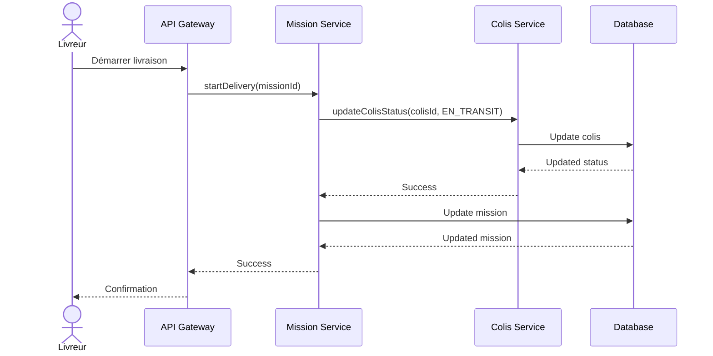

# Sequence Diagram: Delivery Process

```mermaid
sequenceDiagram
    actor L as Livreur
    participant API as API Gateway
    participant MS as Mission Service
    participant CS as Colis Service
    participant DB as Database

    L->>API: Démarrer livraison
    API->>MS: startDelivery(missionId)
    MS->>CS: updateColisStatus(colisId, EN_TRANSIT)
    CS->>DB: Update colis
    DB-->>CS: Updated status
    CS-->>MS: Success
    MS->>DB: Update mission
    DB-->>MS: Updated mission
    MS-->>API: Success
    API-->>L: Confirmation
```