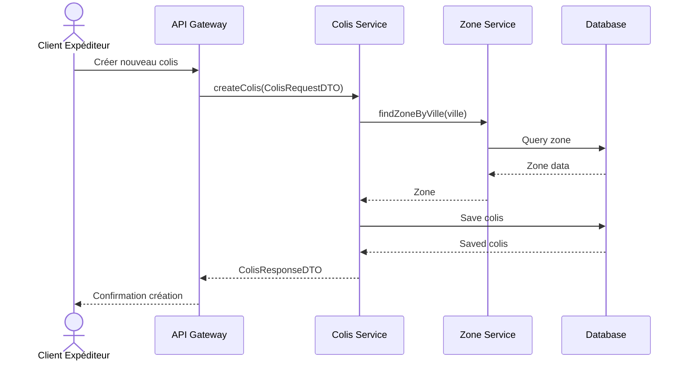

# Sequence Diagram: Package Creation and Assignment

```mermaid
sequenceDiagram
    actor CE as Client Expéditeur
    participant API as API Gateway
    participant CS as Colis Service
    participant ZS as Zone Service
    participant DB as Database

    CE->>API: Créer nouveau colis
    API->>CS: createColis(ColisRequestDTO)
    CS->>ZS: findZoneByVille(ville)
    ZS->>DB: Query zone
    DB-->>ZS: Zone data
    ZS-->>CS: Zone
    CS->>DB: Save colis
    DB-->>CS: Saved colis
    CS-->>API: ColisResponseDTO
    API-->>CE: Confirmation création
```