# SmartLogi SDMS - Use Case Diagram

## Image du diagramme de cas d'utilisation
Vous pouvez placer l'image exportée du diagramme de cas d'utilisation (format PNG, JPEG ou SVG) dans le dossier suivant :
```
docs/diagrams/images/use-case.[png|jpg|svg]
```

## Version Mermaid (pour GitHub)

```mermaid
graph TB
    subgraph Actors
        CE[Client Expéditeur]
        D[Destinataire]
        L[Livreur]
        G[Gestionnaire]
    end

    subgraph Package Management
        CP[Créer Colis]
        TP[Suivre Colis]
        MP[Modifier Colis]
        VP[Voir Liste Colis]
    end

    subgraph Delivery Management
        AD[Assigner Livraison]
        CD[Confirmer Livraison]
        SD[Suivre Livraison]
        MD[Mettre à jour Statut]
    end

    subgraph Zone Management
        CZ[Créer Zone]
        MZ[Modifier Zone]
        AZ[Assigner Livreur à Zone]
    end

    subgraph User Management
        CU[Créer Utilisateur]
        MU[Modifier Utilisateur]
        VU[Voir Utilisateurs]
    end

    %% Client Expéditeur
    CE --> CP
    CE --> TP
    CE --> MP
    CE --> VP

    %% Destinataire
    D --> TP
    D --> CD

    %% Livreur
    L --> SD
    L --> MD

    %% Gestionnaire
    G --> CZ
    G --> MZ
    G --> AZ
    G --> CU
    G --> MU
    G --> VU
    G --> AD
```
